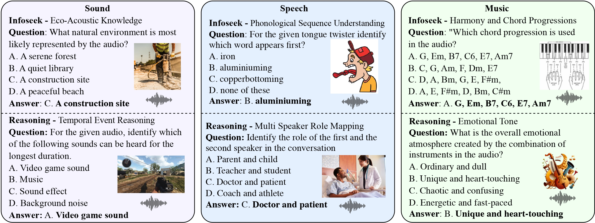

# MMAU: A Massive Multi-Task Audio Understanding and Reasoning Benchmark
[**🌐 Homepage**](https://sakshi113.github.io/mmau_homepage/) | [**🏆 Leaderboard**](https://sakshi113.github.io/mmau_homepage/#leaderboard) | [**📖 MMAU arXiv**](https://arxiv.org/pdf/2410.19168) | [**🔊 test-mini audios**](https://drive.google.com/file/d/1fERNIyTa0HWry6iIG1X-1ACPlUlhlRWA/view?usp=sharing) | [**🔊 test audios**](https://drive.google.com/file/d/1XqkRupC723zAeyDn4dYniqNv4uO-8rEg/view?usp=sharing)
                                          
<p align="center"></p>


This repo contains the evaluation code and MMAU benchmark for the paper "[MMAU: A Massive Multi-Task Audio Understanding and Reasoning Benchmark]()"

## 📢 Announcement

We’re excited to share that our benchmark has been updated based on valuable community feedback!

🔄 What's New in **MMAU-v05.15.25**
- ✅ ~25% of Questions & Answers have been revised for improved clarity and reasoning quality

- 🎧 ~5% of the audio files have been refined to enhance consistency and fidelity

- 🆕 This release is officially versioned as **`MMAU-v05.15.25`**  
   > 📌 *Please cite this version when reporting results going forward*

🌐 Leaderboard Update

Our [**official website**](https://sakshi113.github.io/mmau_homepage/) now hosts updated results for all leading Large Audio Language Models (LALMs) on both:

- The new **`MMAU-v05.15.25`**

- The previous versions (to maintain continuity and preserve prior benchmarks)

We sincerely thank the community for your thoughtful feedback and continued support. We're committed to making this benchmark more robust and impactful for everyone.

## Introduction

### MMAU Benchmark

MMAU is a novel benchmark designed to evaluate mul- timodal audio understanding models on tasks requiring expert-level knowledge and complex reasoning. MMAU comprises **10k carefully curated audio clips paired with human-annotated natural language questions and answers spanning speech, environmental sounds, and music**. It features **27 diverse tasks**, includ- ing 12 information-retrieval types 1 and 15 reasoning types 2, challenging mod- els to perform at the level of human experts in complex, multimodal audio un- derstanding. Unlike existing benchmarks, MMAU emphasizes advanced percep- tion and reasoning with domain-specific knowledge, challenging models to tackle tasks akin to those faced by experts. We assess 18 open-source and proprietary (Large) Audio-Language Models, demonstrating the significant challenges posed by MMAU. Notably, even the most advanced Gemini 1.5 achieves only 66.15% accuracy, and the state-of-the-art open-source Qwen2-Audio achieves only 55.4%, highlighting considerable room for improvement. We believe MMAU will drive the audio and multimodal research community to develop more advanced audio understanding models capable of solving complex audio tasks.



## Dataset Creation

MMAU and MMAU-Pro were meticulously designed to challenge and evaluate multimodal models with tasks demanding proficiency in 27 distinct skills across unique task  that require advanced reasoning distributed across speech, sound, and music domain.


## 🎯 Evaluation

- This [evaluation.py](https://github.com/Sakshi113/MMAU/blob/main/evaluation.py) evaluates a large audio language model's predictions for MMAU benchmark.
- The input should be the original MMAU benchmark file with an additional key named '`model_prediction`' which should contain the ALM's prediction for each question.
  
To run the script:
```bash
python evaluation.py  --input INPUT_JSON_PATH
```

- **We have released a full suite comprising 1000 test-mini samples and 9000 test samples. The 9,000 test questions are available without their answers.**
- Use this [link](https://drive.google.com/file/d/1fERNIyTa0HWry6iIG1X-1ACPlUlhlRWA/view?usp=sharing) to download `test-mini audios`.
- Use this [link](https://drive.google.com/file/d/1XqkRupC723zAeyDn4dYniqNv4uO-8rEg/view?usp=sharing) to download `test-audios`.

The answers and explanations for the test set questions are withheld. You can submit your model's predictions for the **test set** on **[EvalAI](https://eval.ai/web/challenges/challenge-page/2391/overview)**.

## Disclaimers
The guidelines for the annotators emphasized strict compliance with copyright and licensing rules from the initial data source, specifically avoiding materials from websites that forbid copying and redistribution. 
Should you encounter any data samples potentially breaching the copyright or licensing regulations of any site, we encourage you to [contact](#contact) us. Upon verification, such samples will be promptly removed.

## Contact
- Sakshi: ssakshi@umd.edu
- Sonal Kumar: sonalkum@umd.edu
- Sreyan Ghosh: sreyang@umd.edu

## Citation

**BibTeX:**
```
@misc{sakshi2024mmaumassivemultitaskaudio,
      title={MMAU: A Massive Multi-Task Audio Understanding and Reasoning Benchmark}, 
      author={S Sakshi and Utkarsh Tyagi and Sonal Kumar and Ashish Seth and Ramaneswaran Selvakumar and Oriol Nieto and Ramani Duraiswami and Sreyan Ghosh and Dinesh Manocha},
      year={2024},
      eprint={2410.19168},
      archivePrefix={arXiv},
      primaryClass={eess.AS},
      url={https://arxiv.org/abs/2410.19168}, 
}

```
